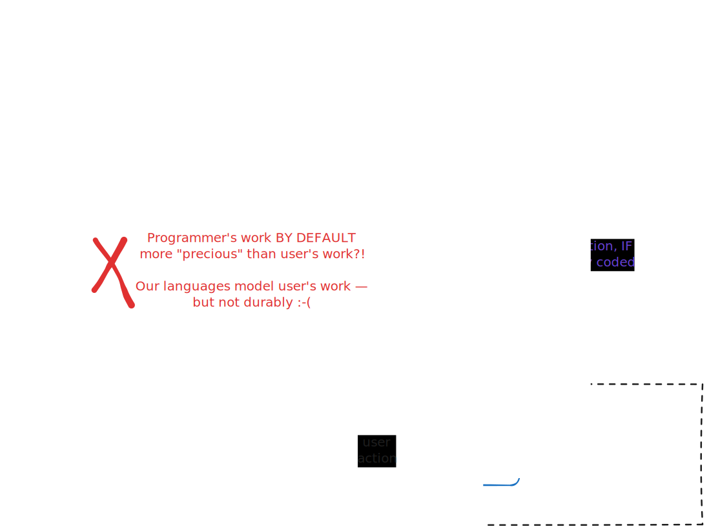

> This README is better viewed online (https://model-view-self-modify.netlify.app/README.html) with interactive iframes, than on [github](https://github.com/cben/model-view-self-modify).
>
> You can also `git clone https://github.com/cben/model-view-self-modify` and serve locally by e.g. `python3 -m http.server` though current implementation won't load offline (I used CDNs).

# what: Model |> View |> Self-Modify architecture

Representing user actions as source code modification is an under-explored approach to state management. I built a JS live coding environment to play with it. Here is a minimal example (https://model-view-self-modify.netlify.app/?load=counter.js):

<iframe src="index.html?load=counter.js" width=1400 height=450></iframe>

1. Try clicking [increment] [decrement].  User actions `WRITE(...)` computation steps into the source, which is immediately re-run and UI is updated.
   (I'm using UPPERCASE names for source-handling helpers)
2. Click [Create counter], observe how now each counter can be inc/decremented separately.

🖉🗃  To edit your own code(s) and persist after reload, open [without `?load=` param](https://model-view-self-modify.netlify.app/?id=you_pick_whatever); each `?id=...` you pick is independent.

I'm excited about it for 2 reasons:
1. Cognitive simplicity: It requires grokking only one concept of change for code & data evolution, and it doesn't force one above the other.
2. By implementing ["Always Already Programming"](https://gist.github.com/melaniehoff/95ca90df7ca47761dc3d3d58fead22d4) literally, it is conductive to [blurring the boundaries](https://joshuahhh.com/paper-plateau-2026-blurry/) between language/env authors | developer | end-user.

There are obvious concerns including ⚠security, scalability, and software updates.  Yet if you want to build malleable, bi-directional, home-cooked, end-user-empowering experiences, I propose this is a fruitful starting point.

### Focus: "Append-mostly" over in-place overwriting

A counter could also be implemented by over-writing `var model = 0` to become `= 1`, `= 2` and so on.  Both are interesting and under-explored!  I choose to focus on appoarches that append "transcript(s)" of computation steps corresponding to user actions, because:

- Non-destructive, easier to clean up after shooting yourself in the foot.
- Capturing your actions in text is a gateway to programming [by demonstration].
- It smuggles advanced-but-somewhat-mainstream practices like MVU/redux and [event sourcing](https://martinfowler.com/eaaDev/EventSourcing.html) into "muggle" hands 😈. It enables fun workflows notably live reload and [time traveling debugging](https://elm-lang.org/news/time-travel-made-easy).

Compare to **"Model-View-Update" architecture** popularized by [Elm](https://elmprogramming.com/model-view-update-part-1.html) / [Redux](https://redux.js.org/tutorials/fundamentals/part-2-concepts-data-flow):  
app state is immutable ("Model" / "store"), View renders UI as a pure function of state,  
user actions are [defunctionalize][]d into pure data e.g. `{ type: "rotateRight" }`,  
and "Update" / "reducer" function dispatches on (action, old model) → to compute new model.

[defunctionalize]: https://www.pathsensitive.com/2019/07/the-best-refactoring-youve-never-heard.html

The difference here is we represent the same user intent as code e.g. `model = rotateRight(model)`, not data, and actually append them in designated  place(s) in app code. (see "Where" section below)  
Bi-directionality here is not some "magical" output->source inference, you write explicit UI code that generates source pieces. You can encapsulate it in components, not unlike React+Redux.

Prior Art: colorForth [magenta variables](http://www.euroforth.org/ef03/oakford03.pdf) are over-writable pointers into code. [James Vaughan](https://jamesbvaughan.com/bidirectional-editing/) and [Jason McGhee](https://news.ycombinator.com/item?id=44437770) shared several projects that overwrite, which are also interesting for using Language Server Protocol to de-couple execution from a specific editor.  

Typst aspires to be a better TeX, designed for fast incremental rendering.  Typst creators used appending to make "interactive" games [icicle](https://typst.app/universe/package/icicle/) & [badformer](https://typst.app/universe/package/badformer/), where user types a sequence of WASD letters & document is re-rendered each time.  Also picked up in community [soviet-matrix package](https://github.com/YouXam/soviet-matrix) implementating Tetris.

I consider PhotoShop layers to be a grand success in showing the public they can be more productive manipulating a *recipe* than directly manipulating the final result.  I've used several EDA software translating menu actions to statements in a Tcl console.  Replayable Dockerfiles brought reproducibility to many more devs.  I want more of these!

The core idea is so simple that I'm sure more people independently discovered it before, but I'm not aware of an agreed-upon term; I hope "Model View Self-Modify" name might stick by comparison to well-understood MVU?

## Why (persistence): User's work deserves being 1st-class

Our languages encourage us to store user's work in runtime data structures (lists, dicts etc.)
but when process dies or code changes, we discover developer's work was durable,
but user's work is lost — and we need a whole other toolbag (file I/O, serialization, pointer swizzling, networked storage APIs, databases, ORMs...) to tackle that 🤕.


- TODO: redraw building on [Joshue Horowitz's visual language](https://joshuahhh.com/dims-of-feedback/)

That creates perverse incentive against fine-grained mixing of software use & modification/automation.  
Even as experienced programmer running 100% open source OS, I'd rather keep my exact state as a user than use my superpowers if that means restarting the process!  The contexts where I do mix them, routinely & fearlessly, are: (1) browser devtools to tweak layout/styling — even if those tweaks won't persist (2) shell prompt, where use is always already textual — and code is frequently disposable (yet retrievable from shell history).

LISPs, Smalltalk, Self famously put code & user's work on equal footing in a single persistent "image" of data structures.  
Here I'm unifying in the other direction, storing both as textual code - this direction is _under-explored_!  
Cf. also Jamie Brandon's [no strings on me](https://www.scattered-thoughts.net/writing/there-are-no-strings-on-me/) on runtime state vs. legibility tradeoffs.

### Challenge: Schema evolution NOT solved, though cognitively flattened

[Cambria](https://www.inkandswitch.com/cambria/) and [Subtext](https://www.subtext-lang.org/) attack a hard problem:

> For example, many live programming techniques treat state as ephemeral and recreate it after every edit, but when the shape of longer-lived state changes then the illusion of liveness is shattered – hot reloading works until it doesn’t. — https://arxiv.org/pdf/2412.06269

I punt on that hard problem and expect user=dev resolve conflicts, just in a conceptually simple way.

Consider event-sourcing DB migration changing the format of past events, or a refactor changing Redux actions structure, invalidating the recorded history. Fixing those requires thinking of both "code change" and "action on data" concepts at once :-/
In Redux devtools, you could download the actions log as JSON, process, and load new actions; it's tedious and in my dev experience I used to just discard the log.
    
In this self-modify paradigm you get same issues — but _history is regular code_, so regular "debug / refactor after an API change" skills apply!  
(Including the option of making API backward-compatible)

## Why: Reduce barriers between app "end user" / developer

First, note the live environment responsible for re-evaluating code upon every change and rendering the result is no longer a "dev tool" — it's now essential part of the app **runtime**.  
(Distributing dev env to ALL users may feel weird in compiler circles, but is 100% normal in Excel circles.)

The source could be hidden by default, but it does give user some powers!  First, undo/redo for free.

- Is time-travel debugging important for end-users?  I think it varies by domain.  
  For example, if your "program" is algebraic chess notation, these were being published in journals for the sole purpose of "users" replaying them step-by-step (on wooden boards — that language got standardized before computers were invented!) to look for "bugs" & "fixes" during "execution"   😉

Prior Art: Graphite.rs image editor has [language-centric architecture](https://www.youtube.com/watch?v=ZUbcwUC5lxA), IIUC any direct manipulation creates re-playable scene graph nodes that are exposed to user.

## Why: Reduce barriers between app developer / IDE developer

If user-facing UI actually edits/inserts code, same skills translate to developer making mini-UIs for themself!  

- TDD helpers: visualize pass/fail/rich results, buttons to `JUMP()` to test's code:
  https://model-view-self-modify.netlify.app/?load=test-helpers.js

- _Help yourself_ to [Babylonian-style Programming](https://arxiv.org/abs/1902.00549) without hard-wired IDE support?  Call a function, render the results.  Write examples as part of the language, not special metadata.

- Literate/notebook helpers?  Below in Tetris example, the code & outputs became long and I added `H1()`, `H2()` functions that render a large heading and sync cursor to source location.

- Level/asset editors.  Below in Tetris example, I express the tetraminoes as arrays e.g.
  ```
  [1,0], [1,1], [1,2], [1,3], 
  ```
  When rendering boards, I've wired all cells to (1) show coordinates (2) insert coordinates at cursor when clicked.  This allowed me to "draw" the shapes by clicking.

  Prior art: [livelits](https://doi.org/10.1145/3462276) render custom UIs inline in code.  
  Can we say here we have "poor man's livelits", only rendering side-by-side with code? Still useful.

TODO: This is an area I hope to explore more, e.g. [moldable inspectors](https://scg.unibe.ch/archive/masters/Kauf18a.pdf), a GUI builder, number/color scrubbers...

Prior Art: [mage: Fluid Moves Between Code and Graphical Work in Computational Notebooks](https://marybethkery.com/projects/Verdant/mage.pdf) prototyped a Jupyter extension that allows UI user actions to edit back the cell's code.

## Why: internal/external DSL perspective

> By admitting input, a program acquires a control language by which a user can guide the program through a maze of possibilities.  
> — [Chuck Moore](http://forth.org/POL.pdf) (for particular definition of "input")

The redux append-only log of user actions _is_ code, in an _app-specific language_.  
The pattern-matching we do in Update / reducer functions _is_ an explicit interpreter for an "external DSL":
```js
... onclick="dispatch({ type: 'rotateRight' })" ...

switch (action.type) {
   case 'rotateRight': ...
```

which adds ceremony & cognitive load.

The architecture I propose here is an "internal DSL" alternative.
Supported actions are written as regular Model → Model functions; you chain them using regular function call syntax.

Prior Art: VisiCalc's original save format was [a series of keystrokes](https://rmf.vc/ImplementingVisiCalc#:~:text=We%20saved%20the%20spreadsheet%20in%20a%20format%20that%20allowed%20us%20to%20use%20the%20keyboard%20input%20processor%20to%20read%20the%20file%2E) replaying which would re-create the spreadsheet.  That's more of an internal hack, [less suitable](https://www.gnu.org/software/emacs/emacs-paper.html#SEC11) as a stable language, and they did later introduce an [interchange format](https://archive.org/details/bitsavers_visicorpDISpecification1981_745801/).  
Converting user input to source code with descriptive function names is a step better.  Long-term interchange is still tied to the host language and still depends on whether you can keep a stable "API".

## Where: One vs. Multiple writable pointers into source

Purely functional MVU gravitates towards all actions forming a single history.  Redux effectively does message-passing without a "receiver", with some benefits — and some modularity costs — compared to OOP.

But for me the overriding goal is *produced code should fit the user's mental model*!  For example, if user is making moves in 2 games concurrently, do they want a single interleaved transcript ("Knight f3 on board 2"), or separate transcript of each game?  Do they want global time-travel/undo, or separate for each game?  (If separate, there is still editor's global Ctrl+Z.)

To support both, I extended the self-modification API with objects that represent locations in source code (`CURSOR()`, `CALLER()`, `LINE_START(HERE())` etc.), each supporting editor actions (which currently consist of `.WRITE(text)` and `.JUMP()`).  That's how the first example manages multiple counters!

(At this point I had to admit the architecture is not purely functional.  Yes, *technically* you can lift all mutation out of _language_ semantics into _IDE_ — every change results in running a brand new program.  But the system feel is of passing around handles to effectively mutable state, making their indentity matter.)

Prior art: My attempts to google ideas like "purely functional self-modifying code" led nowhere, what with self-modifying code being shunned even in imperative circles for _being hard to reason about_ :-)  
However, **Excel**'s surface layer is unidirectional dataflow (barring [cycles](https://youtu.be/5rg7xvTJ8SU?t=91)).  Turning a spreadsheet into "interactive app" may require macros, which can bind actions to editing cells & formulas.  It's up to user whether they'd use a strict append-only log of actions, but either way Excel lets user fully edit the spreadsheet you got after invoking macros.

# Putting it all together: Tetris

1. https://model-view-self-modify.netlify.app/?load=tetris.js

   - [ ] TODO BUG: if you see `cmView is not defined`, edit the left side in any way

   <iframe src="index.html?load=tetris.js" width=1300 height=700></iframe>

2. Scroll both sides to bottom to see tetris game. Click source line opening "TIME TRAVEL" comment and try moving it up and down.
3. Click [rotateR] [left] [right] [down] buttons to play from that moment.
4. Put cursor inside `RCSet([...])` in `newGame` function.  Start clicking board cells to mark them occupied.

🖉🗃  If you want to edit freely, drop the `?load=...` from URL, otherwise your edits get overwritten on reload.
You can append different `?id=...` to keep separate projects in browser localStorage.

## Challenge: O(n²) slowdown

The longer you interact, the longer the code gets, and UI responsiveness will degrade!  This may be bearable for "turn-based" apps and much worse for real-time games.

I'm hopeful incremental computation can help.  Don't re-run code from start, especially when appending near the end.  Feasibility of accurate dependency analisys depends on the language...

- TODO: Perhaps it could be helped by user-provided dataflow structure, e.g. treating functions or notebook cells as separate editors?  Building on the Observablehq runtime, or Marimo could be nice.  
  This might also form a middle ground between single append point and arbitrary pointers — only append at end of a function/cell/file?  
  Some granularity is also interesting for receiving updated software and "opening" your existing data with it...

## Challenge: Multi-player / security

Since both logic & user actions are stored in same text form, it's tempting to sync it by CRDT and gain distributed state _for free_.

I want to try it, but it may well be a dead end.  In particular, the free-form source makes it **impractical to enforce any kinds of permissions**; to interact you need permission to edit, and if you can edit you can cheat.

Even in single-user setting injecting data as code is bug-prone.  TODO: My current `WRITE('string')` helper is risky, should add safe parametrization like in good DB query-building APIs.
