> This README is better viewed [online](https://model-view-self-modify.netlify.app/README.html) with interactive iframes, than on github.
>
> You can also `git clone https://github.com/cben/model-view-self-modify` and serve locally by e.g. `python3 -m http.server` but current implementation won't load offline (I used CDNs).

# what: Model |> View |> Self-Modify architecture

An approach to interactive apps/games I'd wanted to try in a toy language but realized is largely language-agnostic. I made a JS proof-of-concept of it.

To explain it, first recall **"Model-View-Update"** architecture popularized by [Elm](https://elmprogramming.com/model-view-update-part-1.html) / [Redux](https://redux.js.org/tutorials/fundamentals/part-2-concepts-data-flow):  
app state is immutable ("Model" / "store"), View renders UI as a pure function of state,  
user actions are [defunctionalize][]d into pure data e.g. `{ type: "rotateRight" }`,  
and "Update" / "reducer" function dispatches on (action, old model) → to compute new model.

Like "[event sourcing](https://martinfowler.com/eaaDev/EventSourcing.html)", having the actions log enables fun tooling. Notably "live reload" simulated by replaying actions from scratch on new code, and [time traveling debugging](https://elm-lang.org/news/time-travel-made-easy).

[defunctionalize]: https://www.pathsensitive.com/2019/07/the-best-refactoring-youve-never-heard.html

### What I built: a live coding JS environment, where _user actions call `WRITE(...)` to modify app source_:

Now what if we represent the same user intent as code, not data, and actually append them into relevant place in app code?!

https://model-view-self-modify.netlify.app/?load=counter.js :
<iframe src="index.html?load=counter.js" width=1600 height=300></iframe>

This is a bad idea in many ways (⚠ including security!) but it challenges assumptions on essential complexity and walls between language/env authors | developer | end-user.

## Why: Reduce barriers between app "end user" / developer

First, note the live environment responsible for re-evaluating code upon every change and rendering the result is no longer a "dev tool" — it's now essential part of the app **runtime**.  
(Distributing dev env to ALL users may feel weird in compiler circles, but is 100% normal in Excel circles.)

The source could be hidden by default, but it does give user some powers!  First, undo/redo for free.

- Is time-travel debugging important for end-users?  I think it varies by domain.  
  For example, if your "program" is algebraic chess notation, these were being published in journals for the sole purpose of "users" replaying them step-by-step (on wooden boards — that language got standardized before computers were invented!) to look for "bugs" & "fixes" during "execution"   😉

Prior Art: Graphite.rs image editor has [language-centric architecture](https://www.youtube.com/watch?v=ZUbcwUC5lxA), IIUC any direct manipulation creates re-playable scene graph nodes that are exposed to user.

## Why: Reduce barriers between app developer / IDE developer

If user-facing UI actually edits (well, inserts) code, same skills translate to developer making mini-UIs for themself!

- TDD helpers: visualize pass/fail/rich results, button to jump to failing test:

  https://model-view-self-modify.netlify.app/?load=test-helpers.js :

  - [ ] TODO BUG: if you see `cmView is not defined`, edit the left side in any way

  <iframe src="index.html?load=test-helpers.js" width=1600 height=500></iframe>

- _Help yourself_ to [Babylonian-style Programming](https://arxiv.org/abs/1902.00549) without hard-wired IDE support?  Call a function, render the results.  Write examples as part of the language, not special metadata.

- Literate/notebook helpers?  Below in Tetris example, the code & outputs became long and I added `H1()`, `H2()` functions that render a large heading and sync cursor to source location.

- Level/asset editors.  Below in Tetris example, I express the tetraminoes as arrays e.g.
  ```
  [1,0], [1,1], [1,2], [1,3], 
  ```
  When rendering boards, I've wired all cells to (1) show coordinates (2) insert coordinates at cursor when clicked.  This allowed me to "draw" the shapes by clicking.

  Prior art: [livelits](https://doi.org/10.1145/3462276) render custom UIs inline in code.  
  Can we say here we have "poor man's livelits", only rendering side-by-side with code? Still useful.

Prior Art: [mage: Fluid Moves Between Code and Graphical Work in Computational Notebooks](https://marybethkery.com/projects/Verdant/mage.pdf) prototyped a Jupyter extension that lets UI user actions to edit back the cell's code.

## Why: internal/external DSL perspective

> By admitting input, a program acquires a control language by which a user can guide the program through a maze of possibilities.  
> — [Chuck Moore](http://forth.org/POL.pdf) (for particular definition of "input")

The redux append-only log of user actions _is_ code, in an _app-specific language_.  
The pattern-matching we do in Update / reducer functions _is_ an explicit interpreter for an "external DSL":
```js
... onclick="dispatch({ type: 'rotateRight' })" ...

switch (action.type) {
   case 'rotateRight': ...
```

which adds ceremony & cognitive load.

The architecture I propose here is an "internal DSL" alternative.
Supported actions are written as regular Model → Model functions; you chain them using regular function call syntax.

## Why (persistence): User's work deserves being 1st-class

Traditional developer (especially one attempting event sourcing / time travel / record-replay live coding)
needs two concepts of stateful change: changing state inside the app, but also changing the app source.


Our languages encourage us to store user's work in built-in data structures (lists, dicts etc.)
but when code changes (or computer restarts), we discover developer's work was durable,
but user's work is lost — unless we take explicit steps to serialize/deserialize it 😢.

This approach reduces both to only one concept, on equal footing.

  - Think of an event-sourcing DB migration changing the format of past events,
    or a refactor changing Redux actions structure, invalidating the recorded history.
    Fixing those requires thinking of both "change" concepts at once :-/

    In Redux devtools, you could download the actions log as JSON, process, and load new actions.  
    It's tedious and in my dev experience I used to just discard the log.
    
    In this self-modify paradigm you get same issues — but _history is regular code_,
    so regular "debug / refactor after an API change" skills apply!  
    (Including the option of keeping API compatibility)

This does NOT magically solve the hard problems of schema evolution, which [Cambria](https://www.inkandswitch.com/cambria/) and [Subtext](https://www.subtext-lang.org/) are trying to attack.  

> For example, many live programming techniques treat state as ephemeral and recreate it after every edit, but when the shape of longer-lived state changes then the illusion of liveness is shattered – hot reloading works until it doesn’t. — https://arxiv.org/pdf/2412.06269

I punt on that hard problem and expect user=dev resolve conflicts, just in a conceptually simple way.

Prior art: LISPs, Smalltalk, Self famously unified code & user's work in a single persistent "image" of data structures.
Here I'm unifying in the other direction, storing both as textual code.  
Cf. also [Jamie Brandon's on runtime state vs. legibility tradeoffs](https://www.scattered-thoughts.net/writing/there-are-no-strings-on-me/).

## Why (purity): Lift mutation out of _language_ into _IDE_.

1. 199x Browsers popularized what user sees being a pure function of DOM.
2. 201x React popularized DOM being pure function of your data/state ("model").
3. Given a live coding environment where the code you edit gets _re-evaluated on every edit_,  
   we could move _all_ mutation out of the language!

```mermaid
graph LR
  code[[source code]] -->|re-run| state
  p(programmer affects) --> code
  subgraph language semantics
    state[(state)] -->|React| DOM
  end
  DOM -->|browsers| screen --> u
  u(user affects) -..-x|MVU| state
  u -->|💡| code
```



Prior art: My attempts to google ideas like "purely functional self-modifying code" led nowhere, what with self-modifying code being shunned even in imperative circles for _being hard to reason about_ :-)  
However, **Excel**'s surface layer is unidirectional dataflow (barring [cycles](https://youtu.be/5rg7xvTJ8SU?t=91)).  Turning a spreadsheet into "interactive app" may require macros, which can bind actions to editing cells & formulas.  It's up to user whether they'd use a strict append-only log of actions, but either way Excel lets user fully edit the spreadsheet you got after invoking macros.

# Putting it all together: Tetris

1. https://model-view-self-modify.netlify.app/?load=tetris.js

   - [ ] TODO BUG: if you see `cmView is not defined`, edit the left side in any way

   <iframe src="index.html?load=tetris.js" width=1600 height=600></iframe>

2. Start moving "TIME TRAVEL" line up.
3. Put editor cursor before it and start clicking [left] [right] [down] buttons to play from that moment.
4. Put cursor inside `RCSet([...])` in `newGame.board`.  Start clicking board cells to mark them occupied.

If you want to edit freely, drop the `?load=...` from URL, otherwise your edits get overwritten on reload.
You can append different `?id=...` to keep separate projects in browser localStorage.

# Conclusion: Who is this for?

TBH, I don't know.  
**Cons:** The null hypothesis remains that self-modifying code is to be minimized not embraced, the ⚠ security worries are real, and without smart caching performance will decline O(n²)...

🤪 Could this be a stepping stone for **beginner** programmers making home-cooked, offline, single-user apps?!  
**Pros:** It's radically minimalistic: It leverages a mental model they need _anyway_ — how changed code gets re-run — to model user interaction too.  
It smuggles some "advanced" practices like unidirection data flow & event sourcing, with minimal ceremony.  
Most important to me, it'd spread the subversive ideas that code _is_ data _is_ code, that "using" _is_ "programming", that any UI forms a [weak] language, and that tools should be moldable.

Can they later learn saner but more complex practices?  Or would it leave them "mentally mutilated beyond hope of regeneration"? Shrug. Yes my first PC exposure was to BASIC, and it was fun ;-)

**Challange**: If you hate this, I hope it helps you come up with something safer & less crazy that achieves _similar simplicity_.

# TODO Future

* look for max opportunities to use WRITE() during coding - "moldable development"
  - "level editor" kind of stuff
  - color picker

* It's fragile to place editor cursor correctly before interaction.  Add a way to target a fixed place in code.
  - MVP: `BEFORE_COMMENT('FOO').WRITE(...)` targetting `//FOO` or `/*FOO*/`?  
    (It's important to avoid target the code itself that mentions the target name :-)

* go meta: Shift parts of the live env e.g. <DisplayResult> into the env itself so they can be edited?
  - serialize CodeMirror edit actions to a text stream, allow time travel there too?!

but more important:

* computation caching!  Don't re-run code from start, esp. when appending at the end.
  - check out https://tomasp.net/academic/papers/live/, https://pldi17.sigplan.org/series/ic
  - mobx?
  - benefit from user-provided data-flow structure e.g. observablehq cells

* don't reinvent the env — build on observablehq or similar. (https://github.com/asg017/dataflow ?)
  - Observable notebook already parses separate JS cells, [computes data dependencies and manages re-computation](https://observablehq.com/@observablehq/how-observable-runs)...
    - Or Tom's local-first take on Observable: https://github.com/tomlarkworthy/lopecode.
  - See https://maxbo.me/a-html-file-is-all-you-need.html for how to use Observable Runtime library, but also other cool tricks 🤯

* Try React "fast refresh" API to replace re-defined components in-place?

### Q: Multi-player?

Since both logic & user actions are stored in same text form, it's tempting to add collaborative editing and gain distributed state _for free_?

I want to try it, but it may well be a dead end.  In particular, the free-form source makes it **impractical to enforce any kinds of permissions**; to interact you need permission to edit, and if you can edit you can cheat.

### Q: Language qualities that'd make this work better?

Is this really language agnostic?  Kinda, but some language affordances may help:

- postfix order / pipeline operator
- It'd be safer & cleaner to mutate directly AST rather than source text.  So might be easier in homoiconic language like LISP; can approximate with good parser + pretty-printer for round tripping.  
  Specifically, parametrizing inserted code should use safe templating rather than string interpolation to reduce risks of injection.
- immutable semantics conductive to incremental re-computation.

# More prior art

The core idea is so simple that I'm sure many people independently discovered it before, but I'm not aware of an agreed upon term to search...

Perhaps my main contribution will be "Model View Self-Modify" name, and the explanation by comparison to now widely understood MVU architecture.

- Typst aspires to be a better TeX, designed for fast incremental rendering.  Typst creators used a very similar approach to make "interactive" games [icicle](https://typst.app/universe/package/icicle/) & [badformer](https://typst.app/universe/package/badformer/), where user types a sequence of WASD letters & documented is re-rendered each time.  Also picked up in community [soviet-matrix package](https://github.com/YouXam/soviet-matrix) implementating Tetris.

- https://jamesbvaughan.com/bidirectional-editing/ prototypes a widget wired to edit source code over LSP.  Excellent idea to decouple behavior of mutable code from choice of editor!
  - Jason McGhee shared several [related projects](https://news.ycombinator.com/item?id=44437770).
